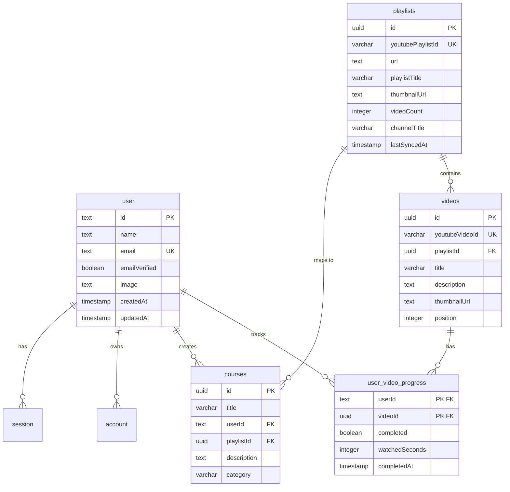

# 🎓 Course Compiler

Welcome to **Course Compiler** — a modern, distraction-free learning platform that transforms standard YouTube playlists into structured, interactive courses with persistent progress tracking. 

No more YouTube recommendations, sidebar distractions, or losing track of where you left off. Just pure, focused learning.

---

## ✨ Features

- **🔗 Playlist-to-Course Conversion**: Simply paste a YouTube playlist URL, add metadata (title, category, description), and compile it into a personal course.
- **🚫 Distraction-Free Player**: Watch YouTube videos in an elegant, isolated environment free from sidebars, comments, and recommendations.
- **📈 Interactive Progress Tracking**: Track completion statuses for each video and visualize your overall course progress with animated progress bars.
- **🔄 Playlist Synchronization**: Sync playlists with YouTube to fetch any updates or new videos added to the original playlist.
- **🔐 Secure Authentication**: Integrated with **Better Auth** supporting:
  - Email & Password sign-up and login.
  - **Google OAuth** social login.
  - Secure session handling.
- **🎨 Modern Design & Theming**:
  - Full support for **Dark Mode** and **Light Mode** (using `next-themes`).
  - Sleek, accessible UI elements designed with Tailwind CSS v4 and **shadcn/ui**.
  - Celebration micro-animations using `canvas-confetti` upon course completion or creation.

---

## 🛠️ Tech Stack

### Frontend & Core
- **Framework**: [Next.js 15+ (App Router)](https://nextjs.org/) & [React 19](https://react.dev/)
- **Styling**: [Tailwind CSS v4](https://tailwindcss.com/)
- **UI Components**: [Shadcn UI](https://ui.shadcn.com/) (using Radix Primitives)
- **Icons**: [Lucide React](https://lucide.dev/)
- **Notifications**: [Sonner](https://erraticgenerator.com/sonner/)
- **Animations**: `canvas-confetti`, `tw-animate-css`

### Backend & Database
- **Database**: [PostgreSQL](https://www.postgresql.org/) (hosted on [Neon Serverless Postgres](https://neon.tech/))
- **ORM**: [Drizzle ORM](https://orm.drizzle.team/)
- **Authentication**: [Better Auth](https://www.better-auth.com/)
- **Data Validation**: [Zod](https://zod.dev/)

---

## 📂 Project Structure

```bash
├── app/                  # Next.js App Router routes and page layouts
│   ├── (auth)/           # Authentication routes (login, signup) and forms
│   ├── (marketing)/      # Public homepage and marketing section
│   ├── api/              # API routes, including Better Auth catch-all route handler
│   └── courses/          # Courses dashboard, course creation page, and course detail view
├── components/           # Reusable UI component library (shadcn/ui + layouts)
│   └── ui/               # Core atomic design components (buttons, cards, inputs, etc.)
├── db/                   # Database schemas and Drizzle configuration
│   ├── drizzle.ts        # Database connection client instance
│   └── schema.ts         # Relational database table schemas & type definitions
├── hooks/                # Custom React hooks (e.g., use-confetti)
├── lib/                  # Helper utilities, YouTube API callers, and authentication configs
│   ├── auth.ts           # Better Auth server-side configuration
│   ├── auth-client.ts    # Better Auth client-side hooks & functions
│   ├── courses/          # DB query operations for courses
│   ├── youtube/          # YouTube Data API Integration (extract, fetch, fetch-videos)
│   └── types.ts          # Zod schema definitions and TS interfaces
├── public/               # Static assets (images, icons, etc.)
├── next.config.ts        # Next.js configurations
├── drizzle.config.ts     # Drizzle Kit migration configuration
└── tsconfig.json         # TypeScript configuration
```

---

## 🗄️ Database Architecture

Course Compiler maintains a relational database setup configured using Drizzle ORM:



---

## 🚀 Getting Started

### 📋 Prerequisites
Ensure you have the following installed on your machine:
- **Node.js** (v18.x or later)
- **PNPM** package manager (recommended) or **NPM**

### 🔑 Environment Variables
Create a `.env` file in the root directory and configure the following variables:

```env
# Database connection string (Neon Postgres recommended)
DATABASE_URL="postgresql://<user>:<password>@<host>/<database>?sslmode=require"

# Better Auth Secret (Generate a random string: openssl rand -hex 32)
BETTER_AUTH_SECRET="your-auth-secret"
BETTER_AUTH_URL="http://localhost:3000"

# Google OAuth credentials (get these from Google Cloud Console)
GOOGLE_CLIENT_ID="your-google-client-id"
GOOGLE_CLIENT_SECRET="your-google-client-secret"

# YouTube Data API Key (enable YouTube Data API v3 on Google Developer Console)
YOUTUBE_API_KEY="your-youtube-api-key"
```

### 📦 Installation

1. **Clone the repository**:
   ```bash
   git clone <repository-url>
   cd course-compiler
   ```

2. **Install dependencies**:
   ```bash
   pnpm install
   # or npm install
   ```

3. **Push database schema**:
   Use Drizzle Kit to automatically create tables in your database:
   ```bash
   pnpm drizzle-kit push
   ```

4. **Start the development server**:
   ```bash
   pnpm dev
   # or npm run dev
   ```

5. **Access the application**:
   Open [http://localhost:3000](http://localhost:3000) in your web browser.

---

## 🛠️ Core Commands

Here are the key development and database commands:

- **Run Dev Server**: `pnpm dev`
- **Build Production App**: `pnpm build`
- **Start Production Server**: `pnpm start`
- **Lint Code**: `pnpm lint`
- **Drizzle Kit Commands**:
  - Push Schema: `pnpm drizzle-kit push`
  - Open Drizzle Studio (DB Viewer): `pnpm drizzle-kit studio`

---

## 🔒 License

This project is licensed under the [MIT License](LICENSE).
